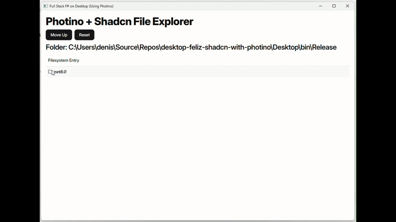

# Feliz on Desktop with Photino (Experimental)

Build a desktop application by embedding a small full stack F# web application in it with the help
of [Photino](https://www.tryphotino.io).

Phontino hosts a lightweight chromium instance in a desktop window and this application embeds a full web application in
it.

Using [ASP.NET Core](https://github.com/dotnet/aspnetcore) as a mini embedded web server for the backend
and [Feliz](https://github.com/Zaid-Ajaj/Feliz)/React on the frontend.

The frontend communicates with the backend via HTTP to access system APIs that are otherwise unavailable from the
browser window.

The data transport between client and server is fully type-safe thanks
to [Fable.Remoting](https://github.com/Zaid-Ajaj/Fable.Remoting)

Here is a gif of the application running during development. Notice how things like hot module reloading work out of the
box so that we can edit the UI code and you see the changes immediately without having to reload the application.



> If you want, you could develop the application in the browser by simply navigating to `http://localhost:5173` but it's
> better to see how it looks like in the desktop window.

## Dependencies

The dependencies need are the .NET SDK (v8.0+) and Node.js (v20+)

When developing on Windows 10, the Edge Dev Channel version needs to be installed
from [Microsoft Edge Insider](https://www.microsoftedgeinsider.com/en-us/download) to be able to view the browser

## Development

Before doing anything, start with installing npm dependencies into the client using `npm install`.

Then to start development mode with hot module reloading, run:

```bash
npm install  # Get dependencies used, like vite
npm start
```

This will start both the Web development server (`npm run start:ui`) and .NET app (`npm run start:desktop`) in watch mode.
In detail:

- Runs an ASP.NET Core backend in the background on port 5000 (API for the frontend)
- Opens a Photino window navigating to localhost:5173 which is where the frontend is being hosted

## Build and package the application

To package your app for your own platform, just:
```bash
npm run build
```